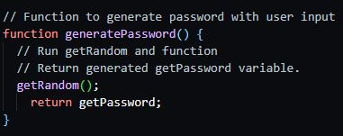
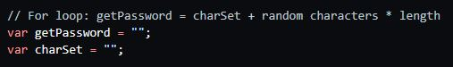
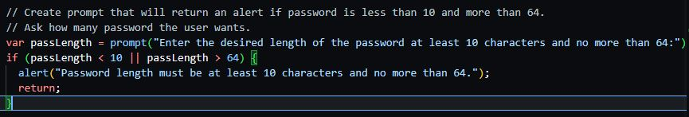
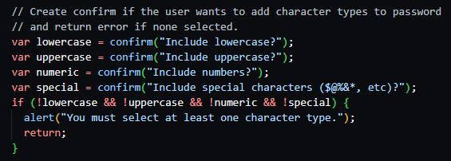
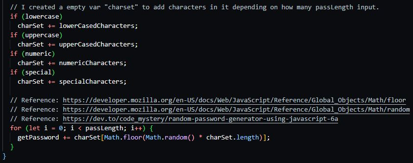
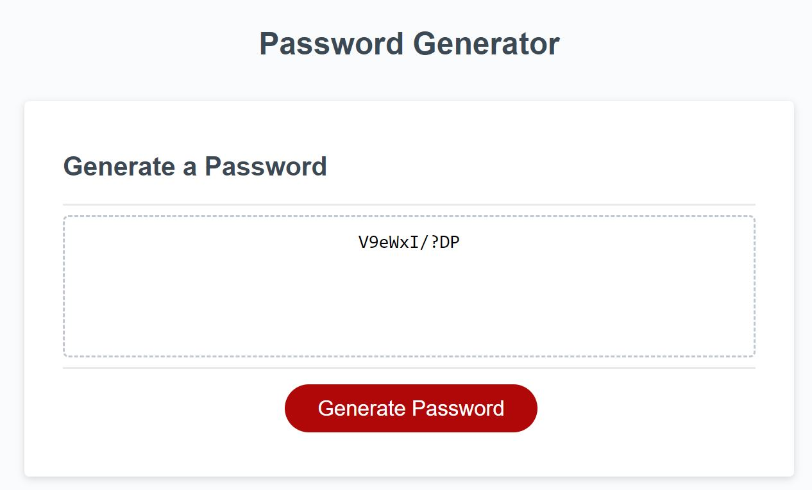

# Intermediate JavaScript: Password Generator

## Link: https://rpjsazon.github.io/password-generator/

## Task

* ## `Generate a password when the button is clicked.`
    

* ## `Global Variables`
    

* ## `Present a series of prompts for password criteria`
  * ### `Length of password`

    * At least 10 characters but no more than 64.
    

  * ### `Character types`
    * Lowercase
    * Uppercase
    * Numeric
    * Special characters ($@%&*, etc).

    
  

* ## `Code should validate for each input and at least one character type should be selected`
    

* ## `Once prompts are answered then the password should be generated and displayed in an alert or written to the page.`
    

